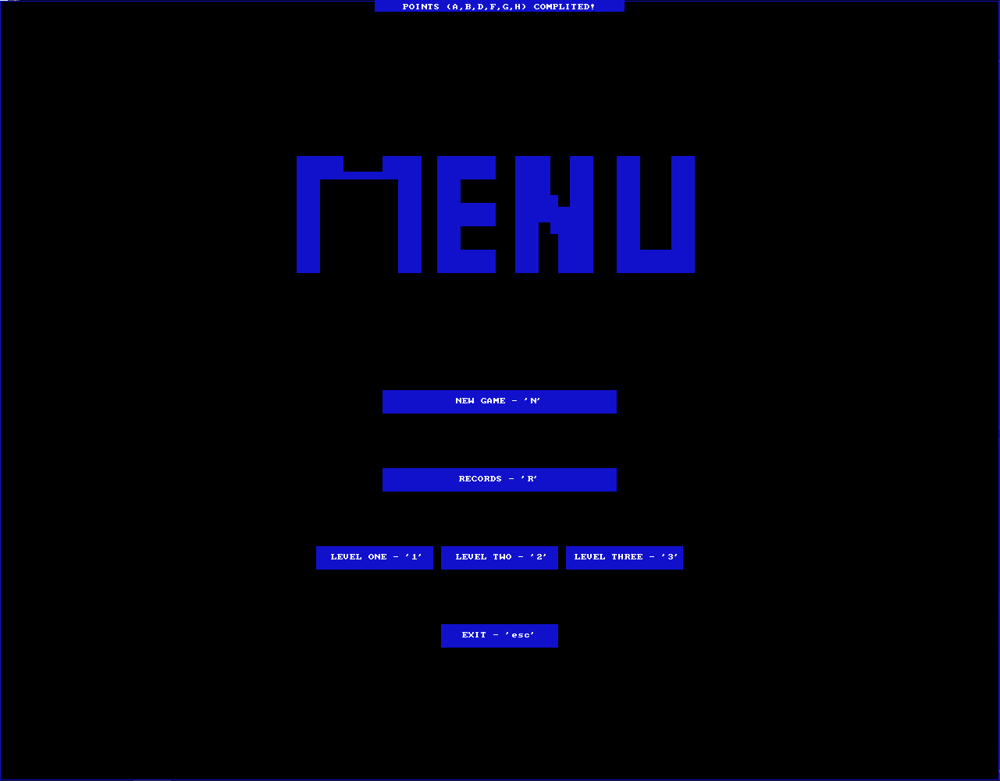
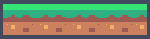

  <h1 align="center">King Donkey Project </h1>

  

    <h3> King Donkey Project with SDL2 library (2.0.3)</h4> 
    <h4>This is a project I wrote as a university project in subject 'Basics of programing'.</h5>
     
  

  

<h3>The goal of this project was to implement the 'Donkey Kong' game and avoid a lawsuit for
similarity with <a href="https://www.youtube.com/watch?v=Pp2aMs38ERY">Original</a>.</h3>

<h4>The game is about controlling the movement and jumps of a character traversing a devastated building on the way to the top. </h4>

# Guide
- There are keyboard guide how to play:
   - Moving the character using arrow keys:  &larr; &uarr; &rarr; ;
   - New game:  'N'
   - Records:  'R'
   - Skip level:  'L'
   - Exit:  'ESC'
   - Levels:  '1' '2' '3'

- Here is your character: 
- There are several coins, collecting them you can get more points: 
- There is your finishing mark:
- There are ladders which you can use for climbing:
- There are many platforms that can help you not to fall out:
- There are your lives:
